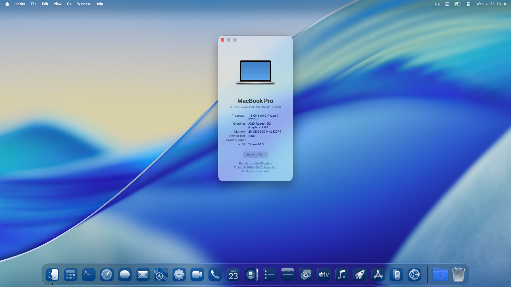

# ideapad-3-15alc6-opencore
#### Opencore/Hackintosh EFI for Lenovo IdeaPad 3 15ALC6

## MacOS Details
Category | Version
:- | :-
[OpenCore](https://github.com/acidanthera/OpenCorePkg) | 1.0.3
MacOS | Sequoia 15.2

## Hardware Specifications
Category | Part | Status
:- | :- | :-:
Model | Lenovo IdeaPad 3 15ALC6 82KU01ATPH | ✅
CPU | Ryzen 7 5700U | ✅
GPU | AMD Radeon Graphics | ✅
RAM | 20GB (4GB soldered + 16GB SODIMM) | ✅
Drive | 512GB SSD M.2 2242 PCIe NVMe | ✅
Audio | Realtek ALC257 (`alcid=86`) | ✅
WiFi + Bluetooth | Qualcomm Atheros QCA6174 | ❌
Touchpad | `VoodooI2CHID` does the trick | ✅

## Notes
- Set `boot-args` as `alcid=97` to make audio and microphone to work.
- Generate your own [SMBIOS](https://github.com/corpnewt/GenSMBIOS), use `MacBookPro16,3` SMBIOS, and edit your `config.plist`.
- Do an `OC Clean Snapshot` with ProperTree and boot your USB installer.
- Atheros Networking Card is unsupported by MacOS. This EFI comes with [HoRNDIS]() kext to support USB Tethering.
- You may want to change your networking card or buy a WiFi USB Dongle supported by [chris1111's driver](
https://github.com/chris1111/Wireless-USB-OC-Big-Sur-Adapter).
- Set graphics memory as `>=1GB` in BIOS to avoid stutters.

## ToDo
- [x] Include [YogaSMC](https://github.com/zhen-zen/YogaSMC)
- [x] Fix keyboard wakeup from sleep
- [x] Fix brightness keys
- [x] Update kexts
- [x] Try macOS Sequoia
