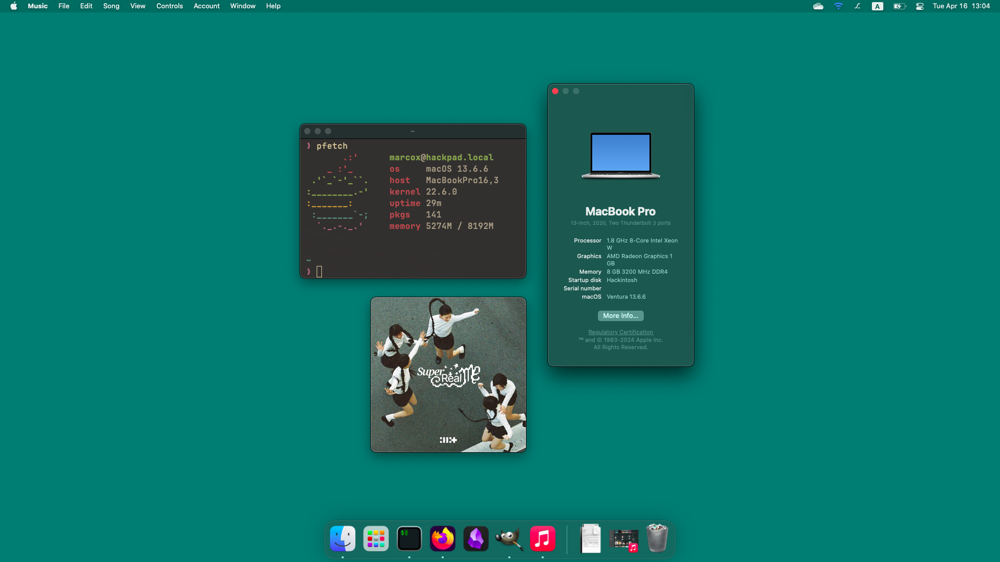

# ideapad-3-15alc6-opencore
#### Opencore EFI for Lenovo IdeaPad 3 15ALC6

## MacOS Details
Category | Version
:- | :-
[OpenCore](https://github.com/acidanthera/OpenCorePkg) | 0.9.9
MacOS | Ventura 13.6.6

## Hardware Specifications
Category | Part | Status
:- | :- | :-:
Model | Lenovo IdeaPad 3 15ALC6 82KU01ATPH | ✅
CPU | Ryzen 7 5700U | ✅
GPU | AMD Radeon Graphics | ✅
RAM | 8GB (4GB soldered + 4GB SODIMM) | ✅
Drive | 512GB SSD M.2 2242 PCIe NVMe | ✅
Audio | Realtek ALC3287 (`alcid=11`) | ✅
WiFi + Bluetooth | Qualcomm Atheros QCA6174 | ❌
Touchpad | IDK it just works | ✅

## Notes
- Set `boot-args` as `alcid=11` to make audio work.
- Dump your DSDT and patch it with [SSDTTime](https://github.com/corpnewt/SSDTTime). Follow the required patches from [NootedRed](https://chefkissinc.github.io/guide/gathering-files/acpi).
- Generate your own [SMBIOS](https://github.com/corpnewt/GenSMBIOS), use `MacBookPro16,3` SMBIOS, and edit your `config.plist`.
- Map your own USB keymapping using [USBToolBox](https://github.com/USBToolBox/tool), and add it to `Kexts` directory.
- Do an `OC Clean Snapshot` with ProperTree and boot your USB installer.
- Atheros Networking Card is unsupported by MacOS. This EFI comes with [HoRNDIS]() kext to support USB Tethering.
- You may want to change your networking card or buy a WiFi USB Dongle supported by [chris1111's driver](
https://github.com/chris1111/Wireless-USB-OC-Big-Sur-Adapter).
- Set graphics memory as `>=1GB` in BIOS to avoid stutters.

## ToDo
- [ ] Include [YogaSMC](https://github.com/zhen-zen/YogaSMC)
- [ ] Fix iServices
- [ ] Fix keyboard wakeup from sleep
- [ ] Fix brightness keys
